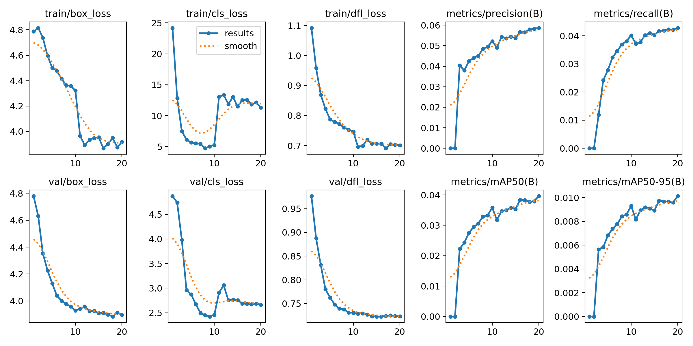
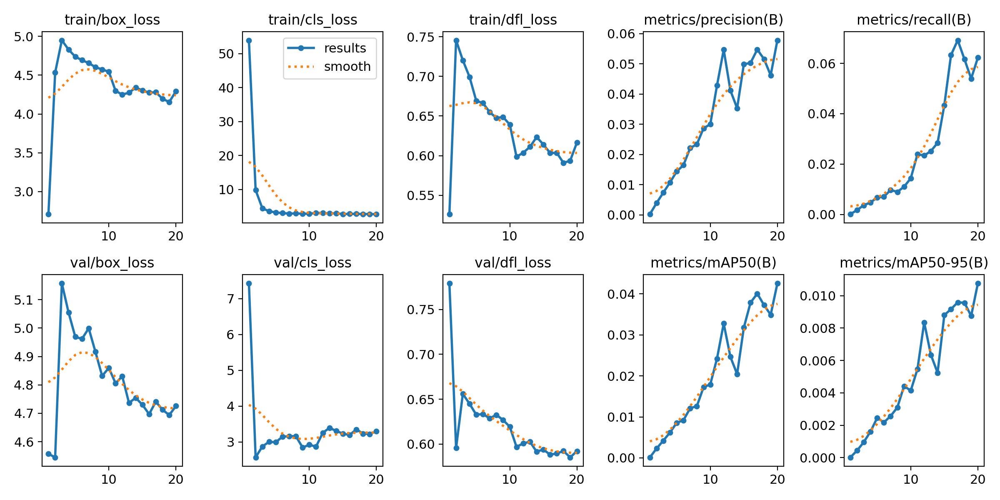

# YOLOv8 Video Annotation

Run YOLOv8 on a video, draw bounding boxes, and save an annotated MP4. 
Optional DeepSORT tracking adds stable IDs across frames.

Strech goal was fine-tuning on xView aerial imagery dataset. (See below)

### Sample Outputs


## Setup

```bash
python -m venv .venv
.\.venv\Scripts\activate
pip install -r requirements.txt
```

## Usage

```bash
python detect_video.py --source input.mp4 --output annotated.mp4
```

Enable DeepSORT tracking:

```bash
python detect_video.py --source input.mp4 --output annotated.mp4 --tracker
```

Use a different model or set confidence:

```bash
python detect_video.py --source input.mp4 --weights yolov8s.pt --conf 0.35
```

## Dataset Utilities

### xView Preparation

`xview_prepare.py` converts xView GeoJSON labels to YOLO format, moves images
into the expected folder structure, and generates train/val split lists.

Expected raw layout:

```
data/xview/raw/
  xView_train.geojson
  train_images/
  val_images/
```

Run:

```bash
python xview_prepare.py --data-root data/xview/raw
```

This produces:

```
data/xview/raw/
  images/train/
  images/val/
  images/autosplit_train.txt
  images/autosplit_val.txt
  labels/train/
```

### xView Convert (Alt Path)

`xview_convert.py` is an alternative converter that writes a YOLO-style dataset
under `datasets/visdrone` (kept for experimentation). If you use it, point your
training config to the generated output.

## Results & Findings

### Baseline + Inference Pipeline
I started with YOLOv8 (first `yolov8n`, then `yolov8m`) and built a video inference
pipeline using OpenCV (`cv2`) to:
- read frames from a video
- run YOLO inference per frame
- draw bounding boxes/labels
- write an annotated MP4 output

I observed that a larger base model (`yolov8m`) produced more detections than
`yolov8n`, but still struggled with the UAV viewpoint.

### Transfer Learning + Fine-Tuning (xView)
To improve detection, I fine-tuned YOLO on **xView**, a satellite/aerial dataset
with **.tif** (GeoTIFF) imagery. xView is designed for high-altitude scenes where
objects are very small relative to the full image. This is a mismatch with my UAV
footage (closer altitude, larger objects, different textures/lighting), but I was able to find 
other higher altitude videos including the city views from above.

I trained for **20 epochs** on a **GPU (L4)**. I first trained on all classes,
then tried a reduced set of four classes (car, train, truck, tower) to simplify
the task. The reduced-class run did not substantially improve detection.

When detections were weak on close-range UAV footage, I looked for higher-altitude
imagery. The model performed better after tuning the confidence threshold and
adjusting `imgsz` to better reflect smaller objects.
#### Fine-tuned on drone (Domain gap visual - data does not align with fine tuned data (Xview dataset))


#### Fine-tuned at higher alt


#### Fine tuned at higher alt


### Model Capacity & Architecture Notes
The fine-tuned YOLOv8n model has **73 layers**, ~**3.01M parameters**, and
**~8.1 GFLOPs** at inference. YOLOv8 uses a CSP-style backbone for efficient
feature extraction, a PAN/FPN-style neck for multi-scale feature fusion, and a
decoupled detection head for box regression and classification. This multi-scale
design is critical for aerial scenes where object sizes vary widely.

For comparison, YOLOv8m has **93 layers**, **~25.8M parameters**, and
**~78.7 GFLOPs**. It captures richer features but requires more compute and
memory. Fine-tuning does not change the parameter count; it updates weights
within the same architecture.

### Metrics Summary (YOLOv8n, 20 epochs)
At `imgsz=1280`, overall metrics remained low: **mAP50 ~0.04** and
**mAP50-95 ~0.01**, indicating limited generalization. The **Car** class showed
the only meaningful lift. This aligns with the domain gap and class imbalance.

### Metrics Summary (YOLOv8m, 20 epochs)
At `imgsz=640`, YOLOv8m improved modestly: **mAP50 ~0.043** and
**mAP50-95 ~0.011**, with small gains on **Car** and **Tower**. The larger model
captured richer features but still struggled due to the dataset mismatch.

### Performance
- **Domain gap**: xView is high-altitude satellite imagery; my footage is low-altitude UAV. Objects differ in scale, angle, and appearance. Perfrom better on higher alt videos as expected.
- **Class imbalance**: xView heavily favors certain classes (e.g., buildings), which can bias the model.
- **Tiny objects**: many xView objects are extremely small, requiring higher `imgsz` and more training to generalize.
- **Limited epochs**: 20 epochs on a hard dataset is often not enough for strong generalization.

### Training Curves

##### YOLOv8n Fine Tuned


##### YOLOv8m Fine Tuned



